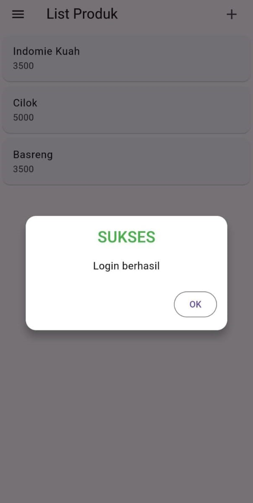

# tokokita

Nama    : Alfido Mazdan Marsyadi

NIM     : H1D022084

Shift Baru : B

Shift Lama : B

## Screenshot

![registrasi]
![Login][login]

### Penjelasan

### *Registrasi*
- **Halaman Registrasi** (registrasi_page.dart):
  - Ada 3 TextEditingController untuk *nama*, *email*, dan *password*.
  - Menggunakan Form yang terdiri dari 4 TextField (termasuk konfirmasi password) dan 1 tombol *Registrasi*.
  - Tombol *Registrasi* memanggil fungsi _submit() yang memvalidasi input dan mengirim data ke RegistrasiBloc.registrasi().

- **Registrasi Berhasil/Gagal**:
  - Jika input valid, tombol *Registrasi* akan memanggil fungsi _submit(). Data yang dikirim (nama, email, password) diteruskan ke *registrasi_bloc.dart* dan dikirim ke server.
  - Jika registrasi berhasil, akan muncul *SuccessDialog* dengan pesan "Registrasi berhasil, silakan login".
  - Jika registrasi gagal, *WarningDialog* akan tampil dengan pesan "Registrasi gagal, coba lagi".

- **Backend Registrasi** (registrasi_bloc.dart):
  - Data registrasi dikirim ke API melalui endpoint ApiUrl.registrasi.
  - Data dikirim dalam format JSON (nama, email, password) dan disimpan ke database melalui RESTful API.

### *Login*
- **Halaman Login** (login_page.dart):
  - Terdapat 2 TextField untuk *email* dan *password* serta 1 tombol *Login*.
  - Pengguna juga bisa diarahkan ke halaman registrasi dengan widget tambahan.

- **Login Berhasil/Gagal**:
  - Setelah menekan tombol *Login*, input divalidasi dan fungsi _submit() dipanggil.
  - Data dari TextField (email dan password) dikirim ke LoginBloc.login().
  - Jika login sukses (kode status 200), token dan ID pengguna disimpan menggunakan UserInfo, lalu pengguna diarahkan ke halaman *List Produk*.
  - Jika login gagal, akan tampil *WarningDialog* dengan pesan "Login gagal, coba lagi".

- **Backend Login** (login_bloc.dart):
  - Endpoint ApiUrl.login digunakan untuk mengirimkan data *email* dan *password*.
  - Server akan memverifikasi kredensial dan jika valid, token autentikasi dan data pengguna akan dikembalikan.

### *List Produk*
- **Halaman Produk** (produk_page.dart):
  - Menggunakan FutureBuilder untuk mengambil data produk dari server melalui ProdukBloc.getProduks().
  - Jika data tersedia, produk akan ditampilkan dalam ListView menggunakan Card yang berisi nama dan harga produk.

- **Backend Produk** (produk_bloc.dart):
  - Fungsi getProduks() mengirim permintaan GET ke endpoint ApiUrl.listProduk.
  - Data produk yang diterima akan ditampilkan dalam bentuk Card pada halaman *List Produk*.
  - Setiap produk pada Card bisa ditekan untuk melihat detail produk.

### *Tambah Produk*
- **Halaman Tambah Produk** (produk_form.dart):
  - Ada 3 TextField untuk *kode produk*, *nama produk*, dan *harga produk*.
  - Jika tombol *Simpan* ditekan dan form valid, data produk dikirim ke backend melalui ProdukBloc.addProduk().
  - Tombol *Simpan* hanya muncul jika form digunakan untuk menambah produk baru (tidak ada data produk sebelumnya).

- **Backend Tambah Produk** (produk_bloc.dart):
  - Metode addProduk() mengirim data produk (kode, nama, harga) ke API melalui endpoint ApiUrl.createProduk.
  - Jika berhasil, produk baru akan disimpan ke database dan pengguna akan diarahkan kembali ke halaman *List Produk*. Jika gagal, akan muncul *WarningDialog*.

### *Ubah Produk*
- **Halaman Ubah Produk** (produk_form.dart):
  - Jika widget produk sudah memiliki data (untuk produk yang ingin diedit), form akan otomatis terisi dengan data yang ada.
  - Terdiri dari 3 TextField yang terisi dengan *kode*, *nama*, dan *harga* produk yang akan diubah.
  - Tombol *Ubah* digunakan untuk menyimpan perubahan, dan jika valid, fungsi _ubah() akan memanggil backend.

- **Backend Ubah Produk** (produk_bloc.dart):
  - Metode updateProduk() mengirim data yang sudah diubah ke API melalui endpoint ApiUrl.updateProduk bersama dengan ID produk.
  - Jika berhasil, produk akan diperbarui di database dan pengguna diarahkan kembali ke halaman *List Produk*. Jika gagal, akan muncul *WarningDialog*.

### *Detail Produk*
- **Halaman Detail Produk** (produk_detail.dart):
  - Menampilkan informasi produk secara detail (kode, nama, dan harga) yang diambil dari widget produk pada halaman *List Produk*.
  - Terdapat tombol *Hapus* dan *Edit* untuk menghapus atau mengubah produk.

- **Fungsi Hapus Produk**:
  - Tombol *Delete* pada *Detail Produk* memanggil metode ProdukBloc.deleteProduk() dan menampilkan dialog konfirmasi.
  - Jika pengguna setuju untuk menghapus, produk akan dihapus dari database dan pengguna akan diarahkan kembali ke halaman *List Produk*.

- **Fungsi Ubah Produk**:
  - Tombol *Edit* pada *Detail Produk* akan membawa pengguna ke halaman *ProdukForm* dengan data produk yang sudah ada untuk memperbarui produk.

### *Fungsi Backend*
- **Tambah Produk** (addProduk()):
  - Mengirim data produk baru ke API menggunakan metode POST untuk disimpan ke database.

- **Ubah Produk** (updateProduk()):
  - Mengirim data produk yang diubah ke API menggunakan metode PUT untuk memperbarui produk di database.

- **Hapus Produk** (deleteProduk()):
  - Menghapus produk dari database menggunakan API melalui metode DELETE.

